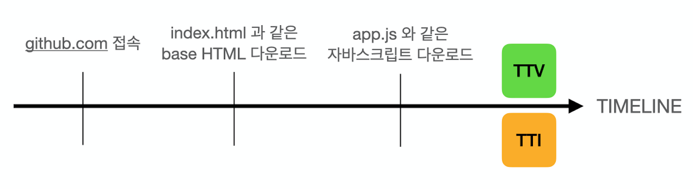
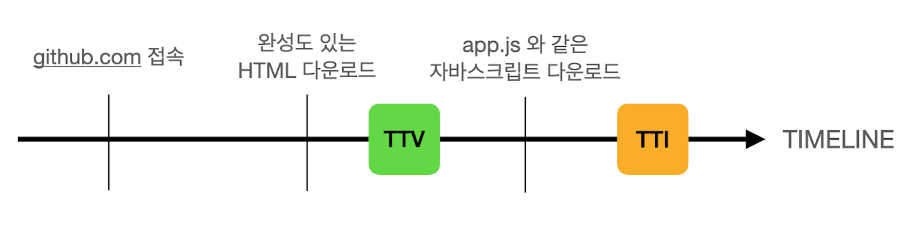

# SSR과 CSR

`SSR(Server Side Rendering)`과 `CSR(Client Side Rendering)`에 대해 알아보자.

## 목차

- [서론](#서론)
- [CSR이란?](#csr이란?)
- [SSR이란?](#ssr이란?)
- [TTI와 TTV](#tti와-ttv)

### 서론

과거의 웹사이트는 대부분이 정적인 HTML을 사용하는 `static site`였다.

페이지를 이동할 때마다 새로운 HTML파일을 요청한다. 요청할 때마다 계속해서 HTML 파일을 다운로드 받아야하고 이동할 때마다 페이지가 '깜빡'하는 현상이 있는 단점이 있다.

이를 보완하기 위해서
`XMLHttpRequest`, `AJAX`등 필요한 데이터만 받아 Javascript를 활용해서 동적으로 HTML을 생성 후 페이지에 보여주는 API가 등장하기 시작한다.

이러한 방식을 기반으로`SPA(Single Page Application)`와 CSR이 현재 웹개발 트렌드로 자리잡게 되었다.

### CSR이란?

그렇다면 CSR이 무엇일까.
Client Side Rendering, 말 그대로 클라이언트 단에서 렌더링이 발생한다는 것이다.

```html
<!DOCTYPE html>
<html lang="en">
  <head>
    <meta charset="UTF-8" />
    <title>Document</title>
  </head>
  <body>
    <div class="root"></div>
    <script src="app.js" module></script>
  </body>
</html>
```

위 코드는 CSR에서 사용되는 `index.html`이다.
`body` 태그 내에 `root` div와 `app.js` script만 달랑 존재한다.

> 즉, 첫 화면은 아무것도 없는 빈 화면이다.

`app.js` 안에는 프로젝트에 사용된 프레임워크, 라이브러리 등 다양한 소스코드들이 들어있다. 이를 통해 동적으로 HTML을 생성하거나 변경하게 되는데, 단점은 이 파일 사이즈의 크기가 커질 수도 있다는 것이다.

브라우저가 `app.js`를 다운로드 받고 소스코드를 실행하며 그제서야 화면에 요소들을 그리게 된다.

#### CSR의 단점

1. 사용자가 첫 화면을 보는데 걸리는 시간이 긴 편이다.

   - 위에서 말했듯이 소스코드가 들어있는 **자바스크립트 파일**의 크기가 커지므로 다운로드 받는데 시간이 걸린다.

2. 검색엔진최적화(SEO) 정도가 낮다.
   - 네이버나 구글 등 검색엔진등은 서버에 올라가 있는 HTML파일을 분석해서 검색엔진에 등록하는데 위에서 봤다시피 `CSR`에서는 엔진이 분석할만한 것이 없다.(_body내에 별게 없으니..._) static site에 비해 **SEO가 낮은 편**이다.

이러한 단점을 보완하기 위해 `SSR`이 등장한다.

### SSR이란?

과거의 `static site`에서 착안하여 (어느정도) 완성되어 있는 HTML파일과 이를 동적으로 제어할 수 있는 `javascript`를 함께 클라이언트에게 전송한다.

이러한 방식을 통해 `CSR`의 단점인 **첫 페이지 로딩속도를 대폭 개선**할 수 있다.

또한 `CSR`과 달리 HTML파일에 정보가 많이 담겨있어 **검색엔진최적화 정도가 향상**된다.

#### SSR의 단점

1. static site와 마찬가지로 페이지 이동 시 '깜빡'하는 현상이 남아있다.

2. 서버에게 요청하는 횟수가 잦아지므로 서버의 부하가 커질 수 있다.

3. 화면 상에 요소들은 나타났는데 동작하지 않는 경우가 있다.
   - 자바스크립트 파일이 다운로드 되기 전에 시도하는 `interacting`이 올바르게 동작하지 않는다. 이는 `TTI(Time To Interact)`와 `TTV(Time To View)`의 관점에서 보면 이해하기 쉽다.

### TTI와 TTV

- TTI란, `Time To Interact`로 페이지가 렌더링되고 사용자가 웹페이지 내에서 **interact 할 수 있게 되는 시점**을 의미한다.

- TTV란, `Time To View`로 사용자가 웹페이지의 **내용/데이터를 볼 수 있는 시점**

#### CSR과 SSR의 TTI/TTV

CSR의 타임라인은 다음과 같다.


SSR의 타임라인은 다음과 같다.


이러한 `TTI`와 `TTV`는 웹사이트의 성능을 분석할 때 중요한 지표로 사용되기도 한다.

1. CSR의 경우, `TTV`까지의 **시간을 줄이기 위해** `javascript`를 얼마나 효율적으로 split 할 수 있는가에 대한 고민이 필요하다.

2. SSR의 경우, `TTV`와 `TTI`간의 차이를 줄이기 위한 고민이 필요하다. 또한 페이지 이동간 '깜빡' 현상 등 **사용자 경험에 대한 고려** 역시 필요하다.
